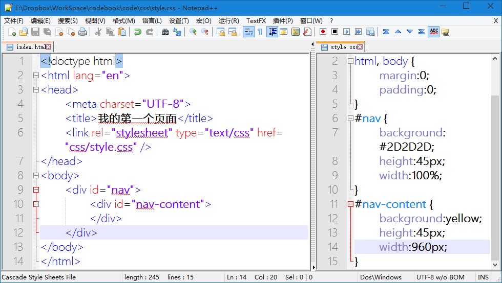
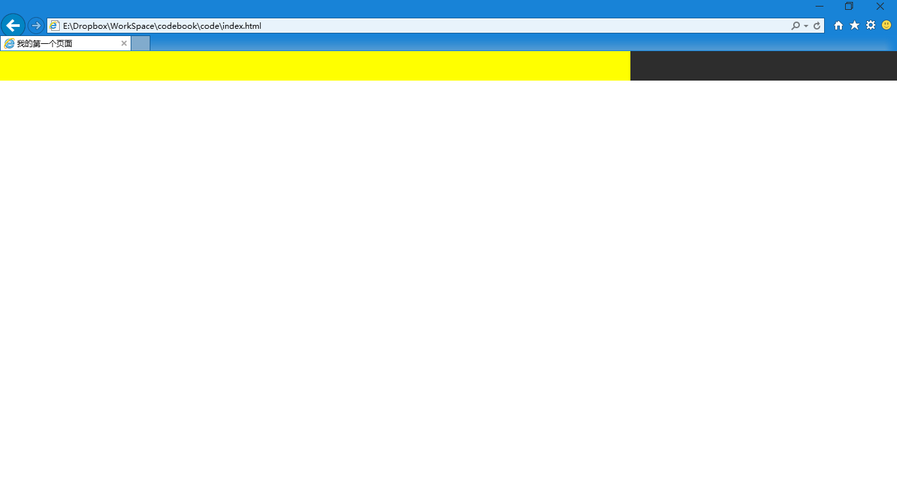
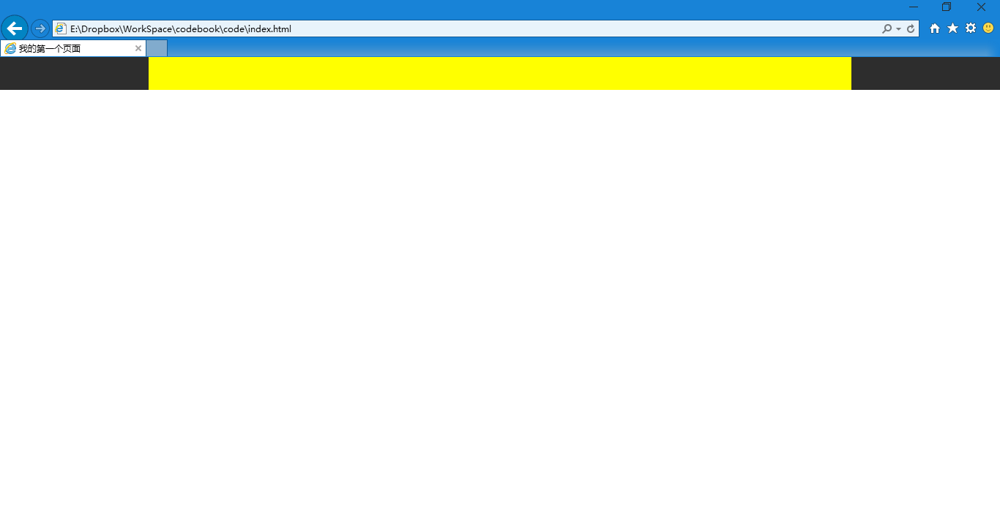

第十六章 导航（二）
===

前一章我们只是做了一个容器，也相当于一个背景。下面我们准备往里放内容。但是在这之前我们要先讲一讲内补和外补。

我先举个例子，现在快递很暴力，我们的包裹都要多层保护才安心。所以我在我的纸箱外面包了一层塑料，厚度是五厘米（夸张了，别在意这个细节）。那么我的纸箱和其他纸箱放在一起，纸箱和纸箱间的距离是多少？就是隔着的那五厘米塑料，对吧？要是两个纸箱都裹着五厘米塑料呢？那就相距 5+5 = 10 厘米。这好像小学一年级数学题。这个裹塑料就是外补。

那么其实保护我们的物品还有一种方法，就是在箱子里面垫上海绵，假设我垫了三厘米海绵再放货物，那货物距离箱子多远？当然就是隔着的这三厘米海绵（别跟我说货物沉把海绵压扁了，我买的劣质海绵，就是不变形）。这就是内补。

外补（margin）和内补（padding）都可以指定特定的方向（上下左右，top，bottom，left，right），写法如下：

	margin:-top:5px;

这就是在元素上面空出五像素来。其他方向以此类推。不写方向的话就是一起设置四个方向，规矩有些复杂，我说说，你听听，记不住的话就等后面慢慢理解

	margin:5px;

这个是四个方向都外补 五像素。

	margin:5px 10px 8px 0;

四个数值的话就是上右下左的顺序，从上开始，顺时针。就好像时钟从十二点开始转起，这样想就记住了。

	margin:5px 10px;

两个数值的话，平均分配啊，第一个数值代表上下（上下两个方向相同的数值），第二个数值是左右。两两相对，想到这个词就记住了。

	margin:5px 10px 8px;

还能再变态点吗？第一个数值是上，最后一个数值是下，剩下的不够分了，左右共用中间的一个数值。这个上下级总是要分开的，中间的左右平等的才可以共用，上边是长辈，下边是晚辈中间平等的是哥们，哥们是一个辈分的，所以一样。

这东西你记不住你就先看明白第一种就好，如果能学会前三种就很好很好了。

好了我们现在回到我们的导航代码上来：

	

	

这是我们上一章的成果，现在我们要是直接在里面写内容的话肯定默认是左对齐，就贴到最左边了，不好看。1920px 宽的显示器，你左上角显示导航，找着都觉得累。那么我们规定一个内容宽度，比如 960px ，我页面的主体内容都在这个宽度范围之内。然后这个960像素的区域又处于显示器的中间，这样就很舒服，也是我们平时最最基础的布局方法。

好了，我们添加一些代码变成如下

	

		

		

	

这个 #nav-content 宽度是 960px ，高度应该跟外边的 #nav 一致，是 45 像素。然后为了我们能看到效果，我先临时的给他一个背景色（如果不设置北京，一般的元素都是透明的，我们就看不到了），所以 css 如下：

	#nav-content {
		background:yellow;
		height:45px;
		width:960px;
	}

放在一起看看

然后我把浏览器最大化之后看看效果。

黄色的区域，也就是 #nav-content 的宽高都没问题，但是他在最左边，而不是页面的中间。我们要让他在中间。

你可能想到了，用外补或者内补把他顶到中间去（在他边上垫上东西，使他呆在合适的位置）。这个想法很正确，那么上下方向肯定是不用补了，都是 0 就挺好。可是左右呢？该补多少？你说我的显示器 1920 像素宽，一边补 480 像素正好。可是你考虑过浏览器的边框么？当然这还是小问题，网页可不是只给一个人看的啊，别人显示器不是这么大怎么办？更简单的浏览器窗口大小变化了怎么办？

所以我们左右补的不能是一个固定的数值，然后我们要这么写

	margin:0 auto;

上下补零（第一个数值），左右自动（第二个数值）。自动就是随便啊，我说了左右平起平坐的，那为了不打架就一人一半最合适啊，来，加上去试试效果。

成功了吧，这个就是我们让元素居中的常用方法。但是你要注意，被居中的元素一定要有固定的宽度啊，否则这事好像不是简简单单平均分配就能解决的了，您说是不？