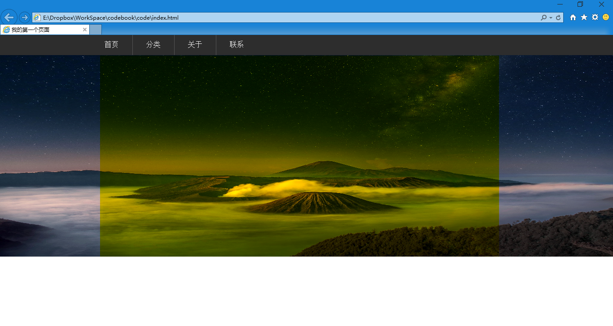
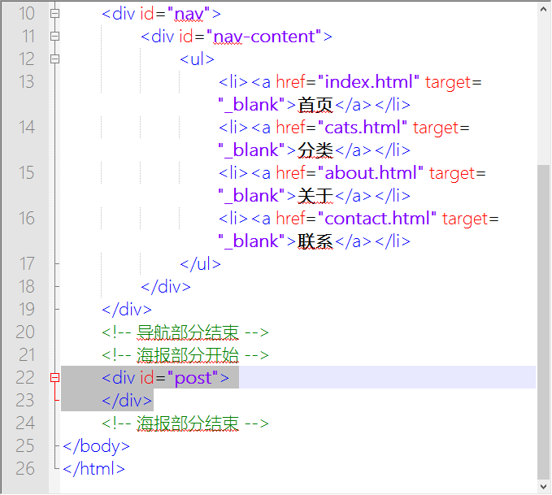

第二十章 海报（一）
===

你说什么？这节不用讲了？大海报就是一个 img 标签嘛，然后设置宽度 100% 就行了。那咱们试试好了。

	

是这个意思吧，对了，海报图片是我在 500px 上顺的，咱就演示效果，别在意那些细节噢

高度太大了，再给个高度，比如 450px 怎么样？

	

变形了，额，那我用 PS 把图片裁剪一下。可是读者的浏览器窗口大小可是都不一样大的呀，这怎么弄？好像是个难题。

还有一个问题你没考虑到，我们假设要给这个大海报加链接的话，你打算则么加？整张都加链接？那样很容易误点击的。看一个网页的时候不小心点错了链接，会让读者心情不好的。

正确的方法是只在中间部分加链接，就如下图中黄色区域.也就是我们说的那960 像素宽的主体内容区域，在这以外的只是装饰。其实我们设计网页的时候也都会先把这个区域确定出来，内容不要超出这个区域。

这时候我们就要换一种方法了。来先写一个 div

	

	

这时候看看我们的代码，你注意我写的注释，适当的添加注释可以让自己更容易看懂自己写的东西。

然后我们去写 css 啦，再说一遍啊，html 就是框架和内容，样式全都扔给 css。这样两个文件看起来都很清楚啊。

	#post {
		width:100%;
		height:450px;
	}

这部分没有疑问吧，然后给这个 div 设置一个背景。

	background:url(../images/post.jpg);

