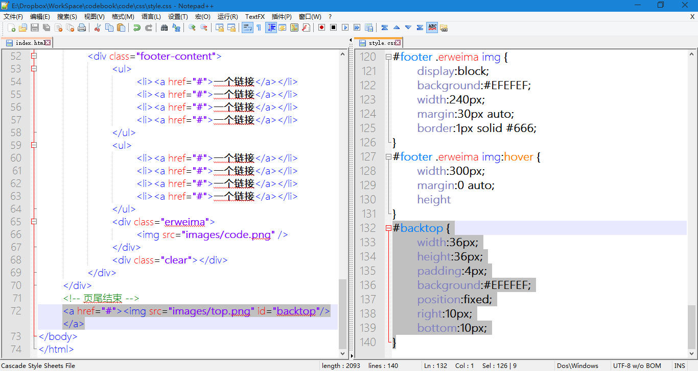
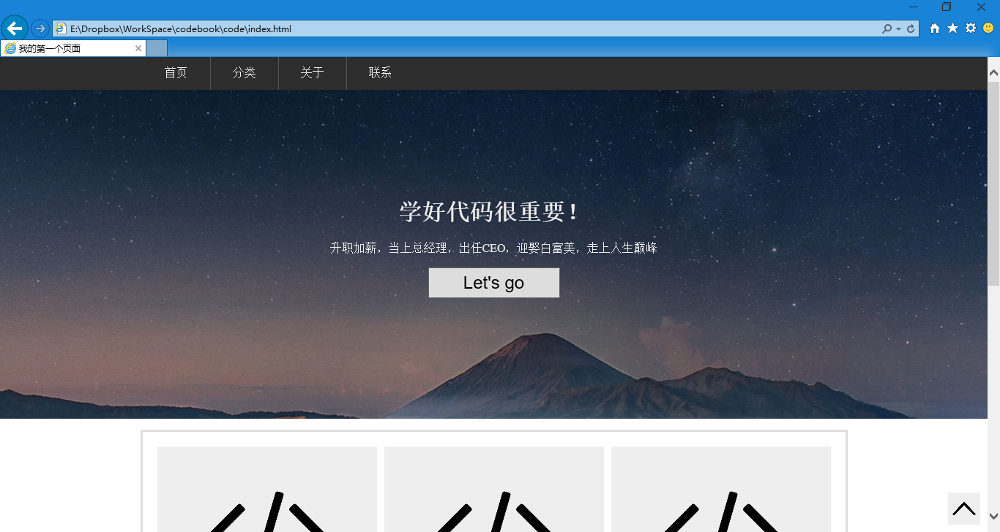
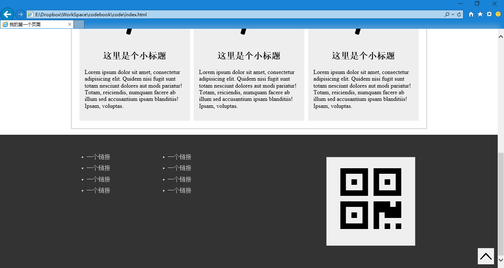

第二十六章 开始新的尝试
===

我们现在知道了一些 css 属性，也在尝试着用他们。但是我们依旧觉得我们无从下手的样子，其实主要还是不熟练罢了，所以多练，多运用是十分十分重要的事情。那么从现在开始我们逐步地做一些很实用的模块玩。

你看的没错，这就是玩，要是认真你就输了。来，我们先玩个简单的，给网页加上一个返回顶部的按钮。首先我们用一个图片来做按钮。

	

这不就是一个图片吗？也起不到任何作用啊。嗯那就给他加个链接，其实只要连接到 # 就可以实现返回顶部的功能。于是我们改成

	

这就做好了，但是当我们想把这个按钮放到我们已经做好的页面时有点纠结，这个按钮放在哪里好？嗯，这是一个问题，那么我们先来给这个按钮（图片）一个 id 然后我们给他设置一些样式看看再说。

	

然后开始给他设置样式，

	#backtop {
		width:36px;
		height:36px;
		padding:4px;
		background:#EFEFEF;
	}

我用的是一个 512 * 512 的透明 png 图标，所以上面的设置你就都能理解了。然后我们引入一个新的属性。我想想叫什么来的……position 它有很多种值，今天我们先使用其中一个。刚才查了下谷歌翻译，position 的意思是“位置”。然后我们要把他的位置设置成为 fixed（固定）。哎呀，这翻译过来了也依旧看不懂。其实就是这个元素的位置是相对于浏览器的，而与其他元素无关。嗯，先做出来看看效果再说。

	#backtop {
		width:36px;
		height:36px;
		padding:4px;
		background:#EFEFEF;
		position:fixed;
		right:10px;
		bottom:10px;
	}

来解释一下后三行的意思，位置是相对于浏览器定位；然后右侧距离浏览器右边缘 10px；底边距离浏览器底边 10px；这么一解释就清楚了，现在我们准备实验代码。

html 部分，就放在我们前边做的网页的 

	</body>

标签之前，就可以了，因为他的位置比较特殊，所以扔在最后就好。css 当然就放在 CSS 文件的最后面就行，如下图

代码放好了开始看效果，然后认真找了一下才发现，他在右下角

这好像没什么特别的啊，但是你向下滚动页面试试，你会发现他一直呆在右下角。

哎呀，曾竟以为多么复杂的效果，原来也就这么几句代码的事。下一节课我们来美化一下这个小按钮。